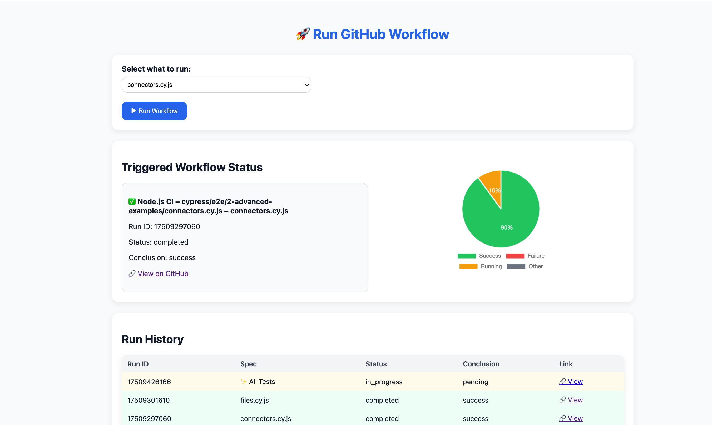

# 🚀 GitHub Actions CI Dashboard

This project provides a **lightweight web dashboard** to run and monitor GitHub Actions workflows.  
It’s built with **HTML + JavaScript** (frontend) and **Vercel serverless functions** (backend APIs).

---

## 📸 Dashboard Preview



---

## 📂 Project Structure

.
├── index.html # Frontend UI (dashboard)
├── api/
│ ├── trigger.js # Triggers a workflow run on GitHub
│ └── history.js # Fetches workflow run history from GitHub
└── .github/
└── workflows/
└── node.js.yml # Workflow definition

markdown
Copiar código

---

## ⚙️ How It Works

1. **Select and Run a Workflow**  
   - The dropdown in `index.html` lets you choose between:  
     - `✨ All Tests` → runs the full Cypress test suite  
     - A specific Cypress spec file → runs only that file  
   - When you click **Run Workflow**, it calls `api/trigger.js`.

2. **Trigger API (`trigger.js`)**  
   - Receives the selected spec.  
   - Dispatches a workflow (`workflow_dispatch`) via the GitHub API.  
   - Waits briefly, then returns the run details (`id`, `url`, `status`, etc.).

3. **History API (`history.js`)**  
   - Fetches the latest workflow runs from GitHub.  
   - Includes run details (`status`, `conclusion`, `url`, workflow name, spec).  
   - Used by the dashboard for:
     - ✅ Status box (only for the triggered workflow)  
     - ✅ Run history table  
     - ✅ Status pie chart  

4. **Dashboard UI (`index.html`)**  
   - **Run button** with spinner feedback.  
   - **Status box** → shows only the triggered workflow run.  
   - **Run history table** → lists the latest runs with spec, status, and links.  
   - **Pie chart** → summary of Success / Failure / Running / Other runs.  

---

## 🔑 Setup

1. **Environment Variables (on Vercel):**
   - `GITHUB_TOKEN` → A **Personal Access Token (PAT)** with `repo` and `workflow` permissions.

2. **Frontend Hosting:**
   - The dashboard (`index.html`) is hosted on **GitHub Pages**.

3. **Backend Hosting:**
   - `trigger.js` and `history.js` live under Vercel’s `/api` directory.  
   - Vercel handles CORS and API calls.

---

## 🛠️ Workflow File (`node.js.yml`)

The GitHub Actions workflow accepts a `spec` input:

```yaml
on:
  workflow_dispatch:
    inputs:
      spec:
        description: "Cypress spec file or 'all'"
        required: true
        default: "all"
And then runs:
- run: |
    if [ "${{ github.event.inputs.spec }}" = "all" ]; then
      npx cypress run
    else
      npx cypress run --spec "${{ github.event.inputs.spec }}"
    fi
```

---

## ✅ Features

Trigger workflows directly from a web page.

Track status of only the triggered run.

Visualize run history and overall pipeline health.

Run either all tests or a single spec file.

---

## 🚧 Future Improvements
Show runtime duration in the history table.

Highlight failures with detailed error logs.

Support multiple workflows (UI dropdown to pick workflow).

---

## 📜 License
This project is licensed under the MIT License — feel free to use, modify, and share.